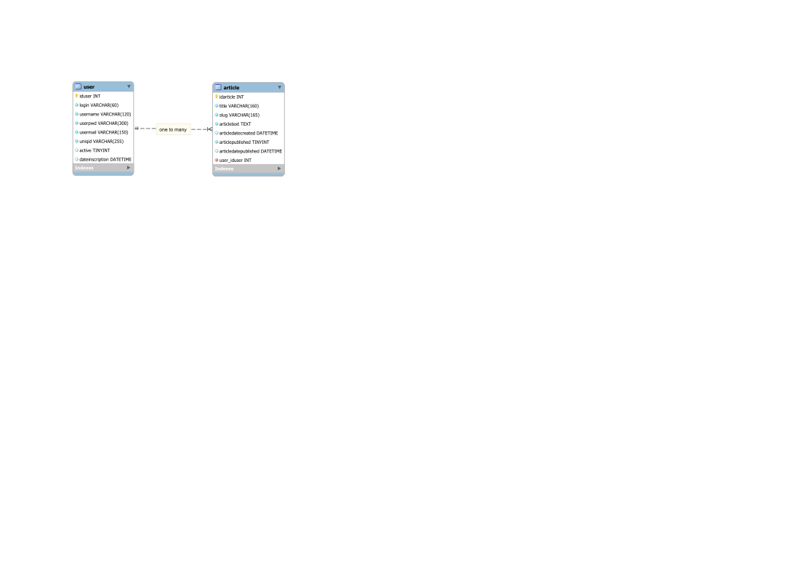

# Exercice MVC 2025 classe 1 - Création et lecture d'articles

## Configuration

Créez un fork de ce dépôt, ensuite créez une branche et un dossier dans le dossier stagiaires avec votre prénom. Copiez les fichiers du dépôt dedans SANS modifier mes fichiers !

Importation du fichier `data\crud_mvc_procedural_structure_v1_datas.sql` dans votre base de données MariaDB.

Vous devrez trouver un template Bootstrap que vous mettrez dans VOTRE dossier `stagiaires/votreprénom/data/` pour le tester.

## Fichiers de configuration

Dans votre dossier stagiaires, Dupliquez le fichier `config-dev.php` et renommez-le-en `config-prod.php`. Il se trouve actuellement dans le `.gitignore`, pour des raisons de sécurité.

## Le dossier public

Le dossier public est la racine de notre site, les utilisateurs ne pourront accéder qu'à ce dossier et ses enfants.

## Identifiants

### Pour se connecter à l'administration

Il faudra se connecter avec un des utilisateurs présents dans la base de données.

### Utilisateurs dans la DB

Les deux premiers sont respectivement le login et le mot de passe non haché.

| Login | Mot de passe | Nom complet | Email | UniqID |
|-------|--------------|-------------|-------|--------|
|`firstUser`|`firstUser`|`Stef Jansens`| `s.jansens@gmail.com`|`mvc683c6765f34168.54713920`|
|`secondUser`|`secondUser`|`Medhi Ben Halima`| `md.halima@gmail.com`|`mvc683c69784afef0.29382054`|
|`thirdUser`|`thirdUser`|`Sylvia Serenna`| `serenna.sy@gmail.com`|`mvc683c69f51e0663.60425661`|

### Notre base de donnée `crud_mvc_procedural`

## Exercice

Il va falloir recréer un mini-site comme vu au cours 

Il devra être en `MVC`:

- avec un contrôleur frontal dans `public`,
- des contrôleurs de type routeurs dans `controller` suivant qu'on soit connecté ou non,
- des modèles qui portent le nom des tables en `Pascal case` dans le dossier `model`, ils se chargeront des requêtes d'affichage et d'insertion d'articles pour `ArticleModel.php` et de la connexion et de déconnexion pour `UserModel.php`,
- des vues qui seront nommées dans le dossier `view` avec des `.` : exemple : `homepage.html.php`.

### Partie publique

#### Un menu public

Il contiendra les liens vers `Accueil`, `À propos`, et `Connexion`

Cette partie sera accessible aux utilisateurs non enregistrés et non connectés, elle contiendra les pages :

#### Pages publiques

- `Accueil` (qui affichera) : Les articles (voir la table `article`) affichés par ordre de publication `articledatepublished` descendant SI `articlepublished` => 1 (0 si non publié), avec le `username` venant de la table `user` lié. Il faut afficher le nombre de messages:
Pas encore de message / Il y a 1 message / Il y a 2 messages | comme dans l'exemple.
- Une page `À propos` qui contiendra un texte static.
- Une page `Connexion` qui contiendra un formulaire permettant de se connecter à l'administration. Il faudra utiliser `password_verify()` pour vérifier le mot de passe. Elle ne sera pas accessible si nous sommes déjà connecté !

### Partie privée

#### Un menu privé

Il contiendra les liens vers `Accueil`, `À propos`, `Déconnexion`
et `Administration`.

#### Pages privées

- `Accueil` : identique qu'en publique, on affichera le `username` de la personne connectée (avec un lien vers `Déconnexion` et plus `Connexion`)
- Une page `À propos` : identique qu'en publique, on affichera le `username` de la personne connectée. (avec un lien vers `Déconnexion` et plus `Connexion`)
- Une page `Administration` qui contiendra un formulaire permettant d'insérer un nouvel article (avec un lien vers `Déconnexion` et plus `Connexion`), elle ne sera pas accessible si nous ne sommes pas connecté ! Il faudra ajouter :

1. Qu'ils doivent être publiés `articlepublished` => 1 via une checkbox à cocher sur le formulaire, sinon ce champ non renseigné mettra `articlepublished` => 0 par défaut.
2. La date de publication `articledatepublished` doit être indiquée via ce même formulaire.
3. Seul l'utilisateur connecté `$_SESSION['login']` peut poster l'article.

- Lors du clic sur déconnexion, l'utilisateur sera déconnecté et sera renvoyé sur l'accueil.

### Sécurité

N'oubliez pas les requêtes préparées et les protections des champs utilisateurs !

### Créez un design minimalist avec bootstrap

Vous êtes libre de faire un design responsive de votre choix ! mettez le dossier en test dans datas.

Bon travail !

## Partie 2

Création d'un CRUD complet sur la page d'administration.

### CRUD pour Create Read Update Delete

Ce seront toutes les actions possible pour l'administration.
